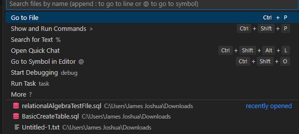
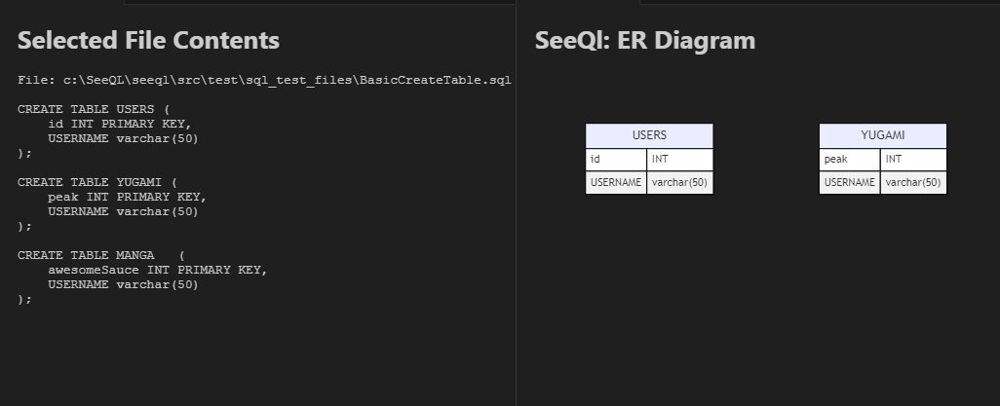

## SeeQL README
## Description:
SeeQL is an extension meant to help users when it comes to working with SQL on Visual Studio Code.
Overall, it’s meant to help users' overall quality of life when it comes to working with it.
Through visualization, helping build SQL queries, and simplifying issues that come with working with SQL.
Issues like making up your own SQL statements, knowing if you have the expected output, and visualizing in general.
SQL, at times, feels very difficult to work with. We want our extension to make it feel as simple as possible for the user.

## Living Document Link: https://docs.google.com/document/d/12MFihRglfg_T3lWZXr646zodLR8koEVt0BNqj5beBrc/edit?usp=sharing

## Repo Layout:
		* Inside seeql contains all dependencies that are needed to build our extension
		* Inside seeql - > src contains our main files for our extension including our tests.
		* Weekly Status report self explanatory
## Features
-Upload data (CSV) that creates a new Database file through a Create Table Statement

-Output an SQL Query after pressing a button, and implementing a db

-Displays a table of results from a query using HTML

-Visualize ER Diagrams via Create Tables

-Visualize Relational Algebra via SQL Query Statements

## Requirements
N/A
## Extension Settings
N/A

## Building and Testing System

### Building System

#### Steps:

1. Git Clone SeeQL from Repository

git clone https://github.com/Taipods/SeeQL.git

2. Once installed, reinstall npm install and npm install sqlite3 in terminal. Just in case, we've had a ton of issues when it comes to sqlite3 so just to be sure. Then run npm run compile. Unsure just do it in case.

npm install

npm install sqlite3

npm run compile

3. Press f5 and run the vscode extension debugger

4. Refer to How To Use System

### Testing System

#### Test: 

1. Follow the same steps as Building System

2. Press f5 and run the vscode extension debugger to test any of the commands and correct visualization

3. Running npm run test

npm run test

4. Run test through

## Functional Use Cases

-- Create a E.R Diagram based on CREATE TABLE SQL statements: User can select a basic command, SeeQL: Create a Diagram of a Create SQL Statement and insert an associated Create Table SQL file, then their data is parsed in the backend and displayed via Webview through mermaid.js. The tables are displayed and connected through lines if references.

-- Create relational algebra based on user created query: User can select a basic command through the command line, SeeQL: Create a Relational Algebra Diagram and insert an associated SQL query, that statement is the parsed in the backend through an SQL parser converted to an ast. The ast is then converted into data that mermaid.js can use to then display that through a diagram and displayed via Webview.

-- Writing a SQL query will show statistics of row and column count in the output: User can select a basic command through the command line, SeeQL: Run SQL Query, but is required to run command SeeQL: Open Database, once the query is run the statistics will be shown.

-- Run SQL Query Statement: User can select a basic command through the command line, SeeQL: Open Database and SeeQL: Run SQL Query where the user gives a db, and gives an SQL statement, which will then return the query results for the user.

## How to use system
Steps:
1. Open Command Line

2. Find any SeeQL Command Lines

3. Select any single one command line
4. Choose a related SeeQl file to that command line

5. Once selected, visualization of that SQL file should be up whether Er Diagram, Relational Algebra, etc.

## Specific commands demo
### OpenDB:
- Opens a .db file to run querries
- On success, prompts button left with open DB
  

### RunQuerry:
- Requires a DB to be opened by OpenDB command
- Requires user to write a sql statment inside sql file
- On click run querry, table appear with stats
  

### CreateERDiagram
- Creates a E/R diagram given a sql file with valid querry

### CreateRelationAlgebra
- Creates a relation algerbra diagram given a sql file with valid querry
  
  

## Release Notes
### Current Tag: v0.7.5.7
### Beta++
